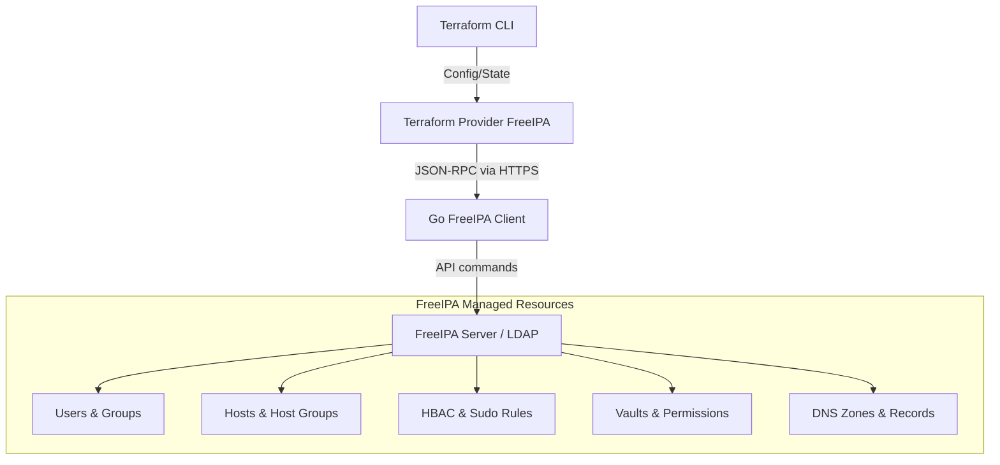

# Terraform Provider FreeIPA

[](https://go.dev)
[](LICENSE)
[](#)
[](https://www.freeipa.org/)
[](https://github.com/chmuri/terraform-provider-freeipa/releases)


This is a custom, feature-rich Terraform provider designed to manage identity, access policies, DNS, host enrollment, and secure skiff (Vault) resources directly inside a **FreeIPA** domain using GH[...]

This provider enables full Infrastructure-as-Code (IaC) pipelines for FreeIPA systems, avoiding manual Web UI operations or shell scripting.

---

## Architecture Overview



---

## Installation

To configure Terraform to use this provider from your private/public registry, add the following to your configuration:

```hcl
terraform {
  required_providers {
    freeipa = {
      source  = "chmuri/freeipa"
      version = "~> 1.1.0"
    }
  }
}

provider "freeipa" {
  host     = "ipa.example.com"
  insecure = false # Set to true to bypass SSL certificate validation
  username = "admin"
  password = "your-password"
}
```

---

## Supported Resources

The provider supports 19 FreeIPA resources and 14 read-only data sources. Key resources include:

### Identity & Group Management
* `freeipa_user` — Manage active or staged user accounts, custom parameters, certificates, SSH keys, authentication types, and enabled/disabled states.
* `freeipa_group` — Manage user groups (POSIX/non-POSIX, nested groups, external members, and member managers).
* `freeipa_host` — Enroll hosts, manage locality, MAC address, SSH keys, OS platforms, and OTP (One-Time Password) generation.
* `freeipa_hostgroup` — Manage groups of host nodes and member managers.

### Access Control
* `freeipa_hbac_rule` — Configure Host-Based Access Control rules to secure service/host access.
* `freeipa_hbac_svc` & `freeipa_hbac_svc_group` — Group services for HBAC rules.
* `freeipa_sudo_rule` — Control sudo command authorization patterns, execution order, and run-as permissions.
* `freeipa_sudo_command` & `freeipa_sudo_command_group` — Define absolute executable paths and group commands for sudo authorization.

### Domain Name System (DNS)
* `freeipa_dns_zone` — Provision internal DNS Zones.
* `freeipa_dns_record` — Create and update records (A, AAAA, CNAME, TXT, SRV, MX, etc.).

### Vault Integration (Permissions Split)
To avoid configuration conflicts and state loops, managing a vault's lifecycle is split into three decoupled resources:
* `freeipa_vault` — Creates and manages the basic CRUD vault object (name, description, type).
* `freeipa_vault_owner` — Assigns owner permissions to users, groups, or service principals.
* `freeipa_vault_member` — Assigns member permissions to users, groups, or service principals.

---

## Usage Example

```hcl
# Create a user
resource "freeipa_user" "developer" {
  username   = "jdoe"
  first_name = "John"
  last_name  = "Doe"
  email      = "jdoe@test.local"
  enabled    = true
  staged     = false
}

# Create a group and add the user
resource "freeipa_group" "dev_team" {
  name        = "developers"
  description = "Development team group"
  users       = [freeipa_user.developer.username]
}

# Define a vault
resource "freeipa_vault" "secrets" {
  name        = "project-secrets"
  description = "Shared development secrets"
  type        = "standard"
}

# Assign developers as members of the vault
resource "freeipa_vault_member" "secrets_members" {
  name  = freeipa_vault.secrets.name
  users = [freeipa_user.developer.username]
}
```

---

## Local Development & Testing

### Prerequisites
* Go `1.26.x`
* Docker and Docker Compose
* Terraform CLI `1.x`

### Setup Local FreeIPA Server
Spin up a local containerized FreeIPA server for integration testing:
```bash
make docker-up
```

### Build & Run Tests
Build the provider binary locally:
```bash
make build
```

Run unit tests:
```bash
make test-unit
```

Run acceptance tests against the docker compose environment:
```bash
make test-acc
```

Run specific acceptance test:
```bash
make test-acc TESTARGS='-run TestAcc_User_CRUD'
```

The test suite includes:
- **28 unit tests** — schema validation for all 19 resources, 6 data sources, and provider  
- **31 acceptance tests** — CRUD, option variants, membership scenarios, data sources

Test results summary (FreeIPA 4.13.1, v1.1.1): 95/108 passing (95%). 13 skipped (KRA not enabled, edge cases). See `provider/resource_acc_test.go` for full test matrix.

Clean up environment:
```bash
make clean
```

---

## License
This project is licensed under the MIT License - see the [LICENSE](LICENSE) file for details.
